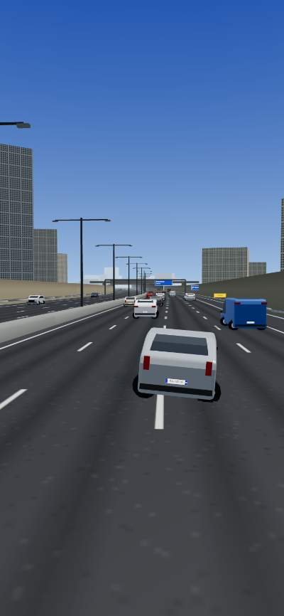
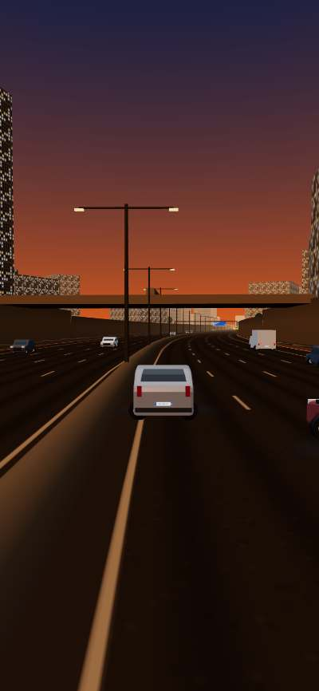
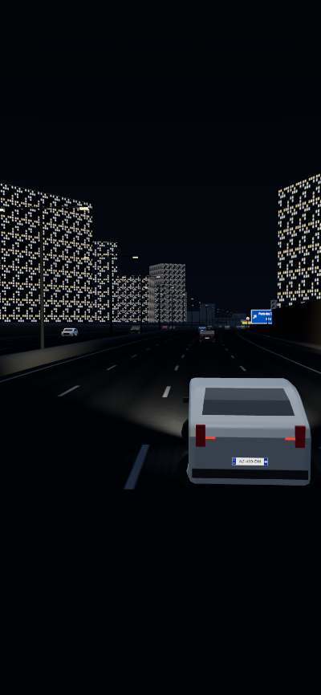
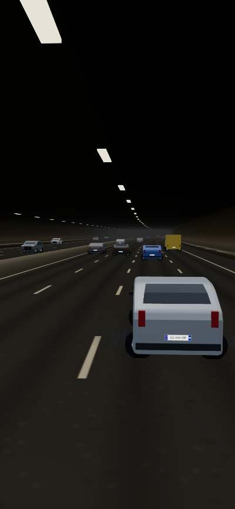
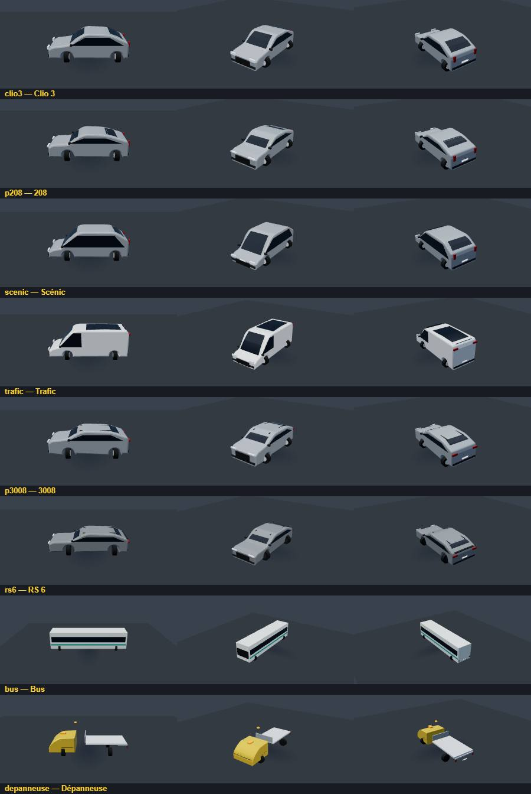

# Périph' Rush 🏁

**Endless runner de conduite sur le boulevard périphérique parisien.**
Départ Porte Maillot au volant d'une Clio 3 : parcours la plus grande distance,
boucle le plus de tours du périph, frôle le trafic… sans jamais toucher personne.
La moindre collision met fin à la partie.

Jouable directement dans le navigateur, installable en PWA plein écran sur iPhone.

| Jour | Coucher | Nuit | Tunnel |
|---|---|---|---|
|  |  |  |  |

## 🎮 Jouer

- **En ligne** : https://daryl-25.github.io/Periph-Rush/
- **Sur iPhone (recommandé)** :
  1. Ouvre l'URL dans **Safari**.
  2. Bouton **Partager** → **« Sur l'écran d'accueil »**.
  3. Lance « Périph' Rush » depuis l'icône : plein écran, 60 FPS, hors-ligne.

### Commandes
- **◀ / ▶** : direction (gauche de l'écran)
- **GAZ / FREIN** : pédales (droite de l'écran) — accélération automatique activable dans Réglages
- Clavier (desktop) : flèches ou ZQSD/WASD, Espace = frein, P/Échap = pause

## 🚗 Le jeu

- **Périphérique réel** : boucle de 35,04 km construite depuis les coordonnées GPS
  des 30 portes (sens intérieur), tranchées, murs antibruit, tunnels (Lilas, Vanves,
  Ternes), viaducs de la Seine, échangeurs, panneaux de sortie aux vraies portes,
  PMV à messages variables, cartouches « BD PÉRIPHÉRIQUE », skyline (Tour Eiffel,
  Sacré-Cœur, Montparnasse, La Défense, Mercuriales, Invalides).
- **35+ véhicules** modélisés procéduralement, sans logos : Clio 2→6, Mégane, Scénic,
  Trafic, 206→5008, C1/C3/C4, A 250, GLA, C 63 S, Série 1, M5, Yaris/Auris/Corolla,
  A1/A3/Q3, RS 6, T-Max 530/560, X-Max, GS 1250, X-ADV + génériques, taxis, bus,
  fourgons, dépanneuses, véhicules municipaux.
- **Trafic vivant** : IA de suivi (IDM), changements de voie clignotant à l'appui,
  motos en interfile, chauffards rares (RS 6, M5, C 63 S), vagues de densité,
  bouchons fantômes qui redémarrent, insertions aux portes.
- **Événements** : chantiers balisés (cônes, flèche lumineuse, barrières, camion
  municipal) et accidents (véhicules arrêtés, dépanneuse, gyrophares) annoncés
  par panneaux et PMV.
- **Plaques françaises SIV** générées (bande euro + département, Île-de-France
  majoritaire) et plaques étrangères occasionnelles (D, NL, B, CH, L, E, GB).
- **Ambiances** : jour, coucher de soleil, nuit, pluie nocturne, brouillard, pluie —
  l'heure avance à chaque tour, la difficulté aussi (densité, vitesse, motos, événements).
- **Score** : distance × multiplicateur de conduite propre, frôlements en combo,
  bonus vitesse, 25 000 pts par tour. Pièces → déblocage de tout le garage en jouant.
- **Défis quotidiens**, records, statistiques, personnalisation des couleurs.



## 🛠 Développement

Aucun build : HTML/CSS/JS modules + Three.js vendorisé.

```bash
python tools/devserver.py 8814     # http://localhost:8814 (Cache-Control: no-store)
```

- `?test` : mode test (boucle pilotable hors focus + `__periph.step(n)`)
- `tools/carviewer.html` : planches-contact des véhicules
- Architecture détaillée : [docs/ARCHITECTURE.md](docs/ARCHITECTURE.md)

### Déployer une mise à jour

1. Incrémenter `CACHE` dans `sw.js` (`periph-vN`) **et** les `?v=N` de `index.html`.
2. `git push` (GitHub Pages sert `main` à la racine).

## 📄 Licence

Jeu original créé avec Claude Code. Three.js © MIT. Aucune affiliation avec les
constructeurs automobiles : silhouettes stylisées sans logos ni badges.
